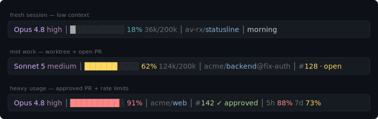

# claude-code-statusline

A compact, color-coded status line for [Claude Code](https://claude.com/claude-code). It shows your model, context usage, location, session, PR review state, and rate limits — at a glance, on a single line.



> The colors and segments above are rendered exactly as they appear in your terminal. Segments only show up when Claude Code provides the data, so the line stays as short as your situation allows.

## What each segment means

| Segment | Example | Notes |
| --- | --- | --- |
| **Model + effort** | `Opus 4.8 high` | The active model and reasoning effort level. |
| **Context bar** | `██████▒▒▒▒ 62% 124k/200k` | How much of the context window is used. Bar fills left→right and shifts **gray → yellow → coral** as it climbs (≥60% yellow, ≥85% coral). |
| **Location** | `av-rx/claude-code-statusline@fix-auth` | `owner/repo` when in a git repo (with `@worktree` if applicable); otherwise the directory name. |
| **Session** | `morning-session` | The current session name, if set. |
| **PR** | `#142 ✓ approved` | Pull request number and review state: `✓ approved`, `✗ changes_requested`, `~ draft`, or `· open`. |
| **Rate limits** | `5h 88% 16:05  7d 73% Jul 3 9am` | 5-hour and 7-day usage with reset times. Percentages highlight when elevated. |

Empty segments are omitted, and the separators (` │ `) collapse accordingly.

## Requirements

- **Claude Code** (the status line uses its [status line feature](https://docs.claude.com/en/docs/claude-code/statusline)).
- **bash** and **Node.js** on your `PATH` (Node is used to parse the JSON Claude Code pipes to the script).
- macOS or Linux. On Windows, run it under **WSL** or **Git Bash** (both provide bash + the date/awk tools the script relies on).

## Install

### Option A — let Claude Code do it (easiest)

Download `install-statusline.sh`, then in a Claude Code session say:

> run install-statusline.sh to set up my status line

The installer will write the script and wire up your settings.

### Option B — run it yourself

```bash
bash install-statusline.sh
```

This will:

1. Write the status line script to `~/.claude/statusline-command.sh`.
2. Merge a `statusLine` entry into `~/.claude/settings.json`, **preserving any existing settings** (a timestamped `.bak` backup is made first).

Then **restart Claude Code** (or open a new session) to see it.

The installer is safe to re-run — it just refreshes the files.

### Option C — manual

Copy `statusline-command.sh` to `~/.claude/statusline-command.sh`, make it executable, and add this to `~/.claude/settings.json`:

```json
{
  "statusLine": {
    "type": "command",
    "command": "bash ~/.claude/statusline-command.sh"
  }
}
```

```bash
chmod +x ~/.claude/statusline-command.sh
```

## Customizing

All colors live in the `Colour palette` block at the top of `statusline-command.sh` as [256-color ANSI codes](https://en.wikipedia.org/wiki/ANSI_escape_code#8-bit). Edit those to restyle any segment. The thresholds for the yellow/coral warnings are in `make_bar` and `pct_color`. After editing, re-run the installer (or just re-copy the file) and start a new session.

## Uninstall

Remove the `statusLine` key from `~/.claude/settings.json` (restore a `.bak` if you'd like), and optionally delete `~/.claude/statusline-command.sh`.

## License

[MIT](LICENSE)
